## Полет в Грузию

Добрый день, уважаемый читатель.

Однажды я решил навестить лучшего друга в Тбилиси и полетел, словом это был мой первый самостоятельный вылет за границу, я очень переживал, потому что некоторые моменты пойти не так, к несчастью.. они и пошли не так :)

Начну с того, что рейс был с пересадкой в Баку, пересадка длилась 1,5 часа, а вылет и прилет приходились на разные терминалы, в общем я боялся, что просто напросто не успею на пересадку. Как назло рейс из Москвы задержался, оно и не удивительно, метель была такая, что эту многотонную крылатую машину заносило на взлетной полосе. По итогу вместо положенных 1,5 часа остался час. 

Быстро соориентировавшись, я нашел товарища по несчастью, который тоже опаздывал и мы с ним побежали сквозь все очереди на пересадку, благо к нам относились с пониманием и пропускали.

 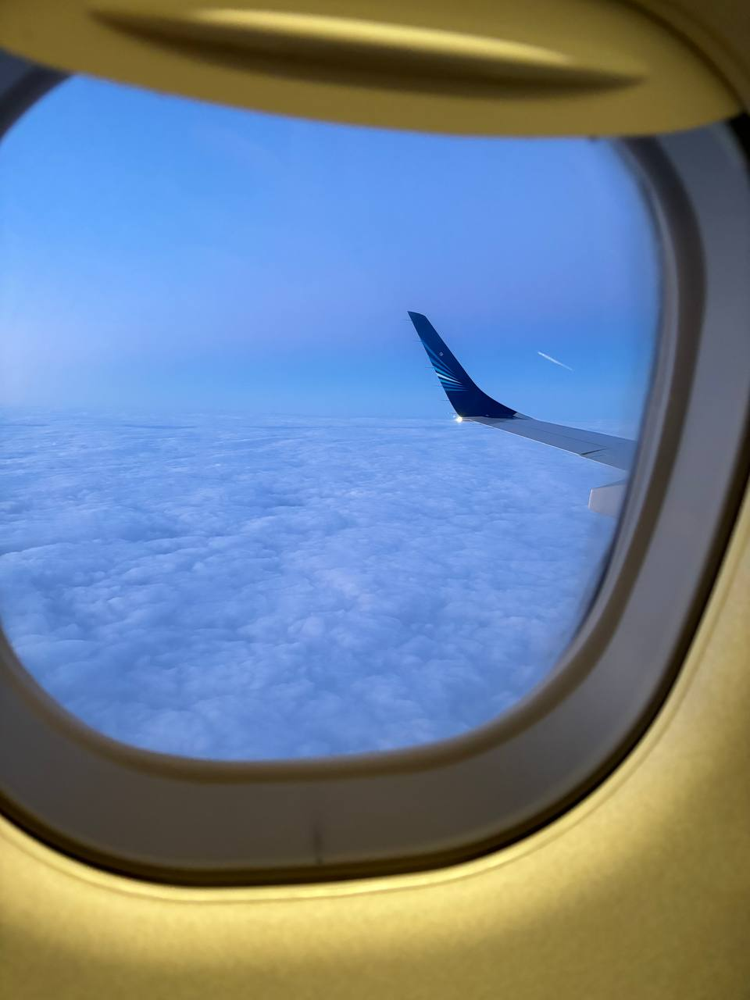

## Прилет в Грузию

Я прилетел благополучно на комфортабельном эмбраере, вышел из самолета и пошел первом делом менять валюту, потом хотел купить местную сим-карту, но цены привели меня в ужас, поэтому я принял отчаянное решение ехать на такси без связи в центр и там купить симку, благо в Тбилиси работает Яндекс Такси, и я доехал по разумной цене.
(По итогу сим-карта обошлась мне  в 4  раза дешевле, чем в аэропорту). 

## Прогулка по Тбилиси

Возникнет вопрос, почему меня никто не встретил в аэропорту. А все дело в том, что что мой друг находился на работе и не мог увидеться со мной ранее, чем в 6 часов вечера, поэтому до этого времени я нашел чебе развлечение - исследовать данный город самостоятельно. Но я и не жаловался, самому было интересно везде побродить. Рассписывать, что я видел долго, но скажу, город хороший, мне понравился, погода тоже жаловала.

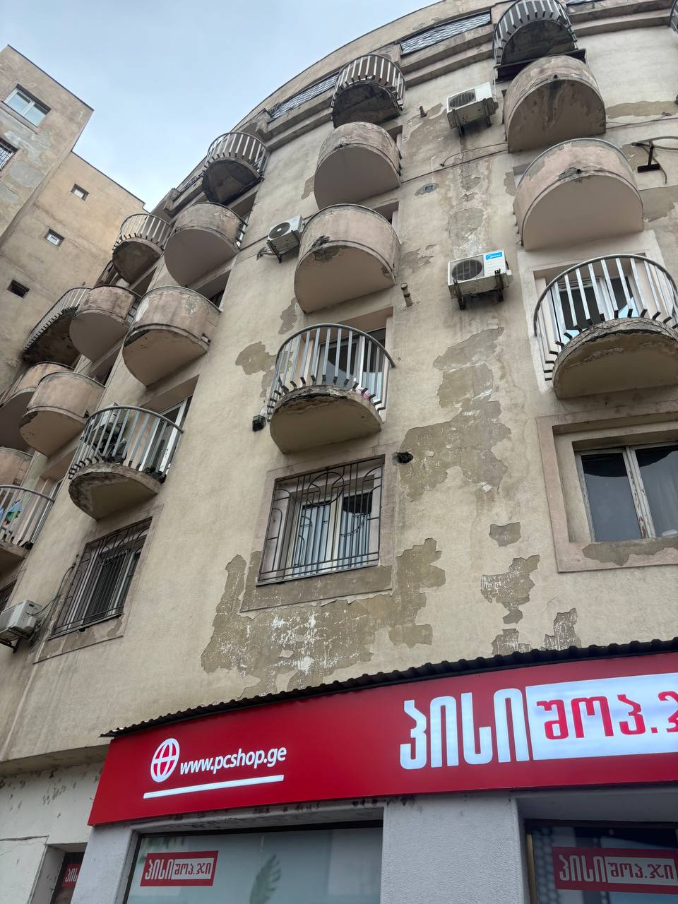

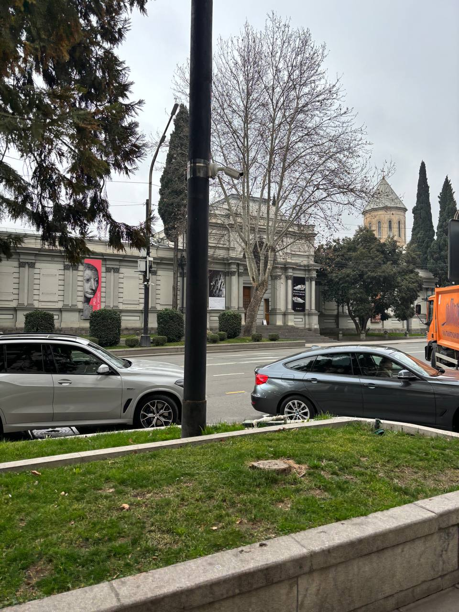

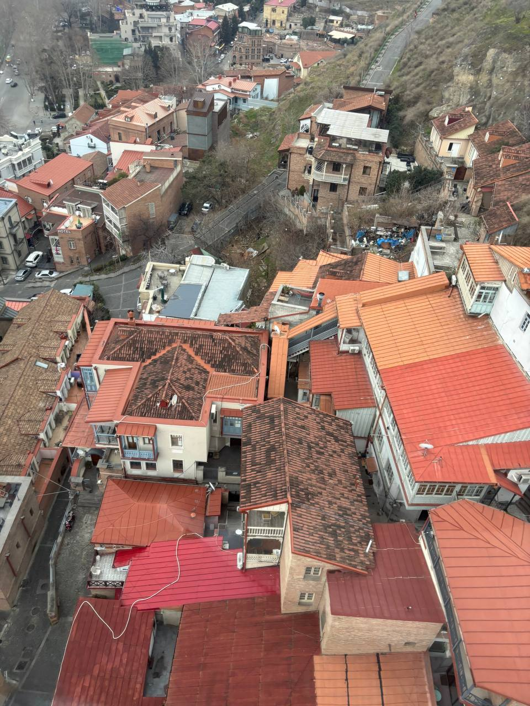

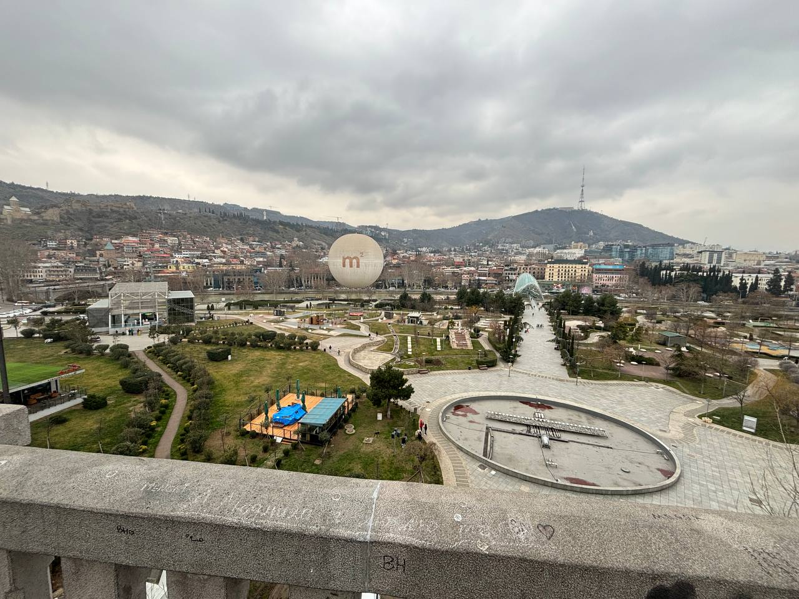

## Самое поразительное

Все-таки еще опишу, что меня удивило по пунктам
 - Бродячие собаки (они повсюду, даже в здании аэропрта) 
 
 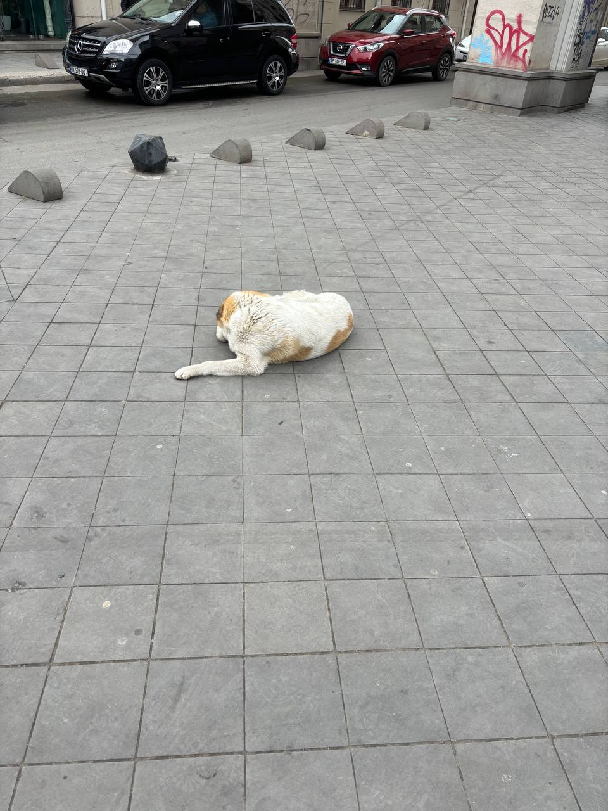
 
 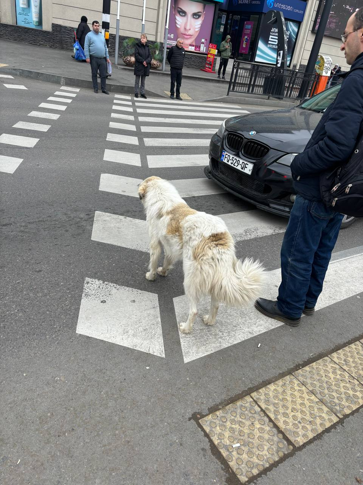
 
 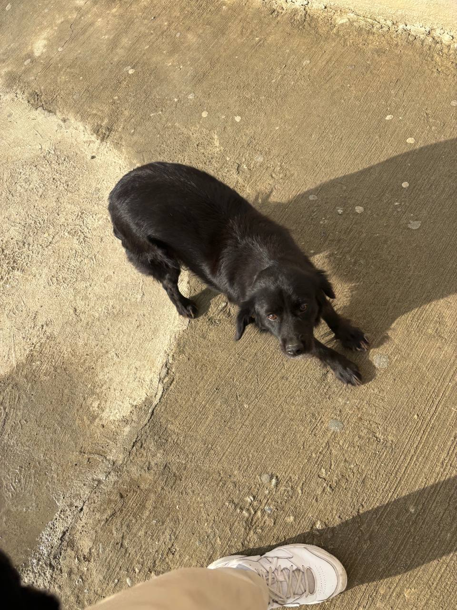
 
 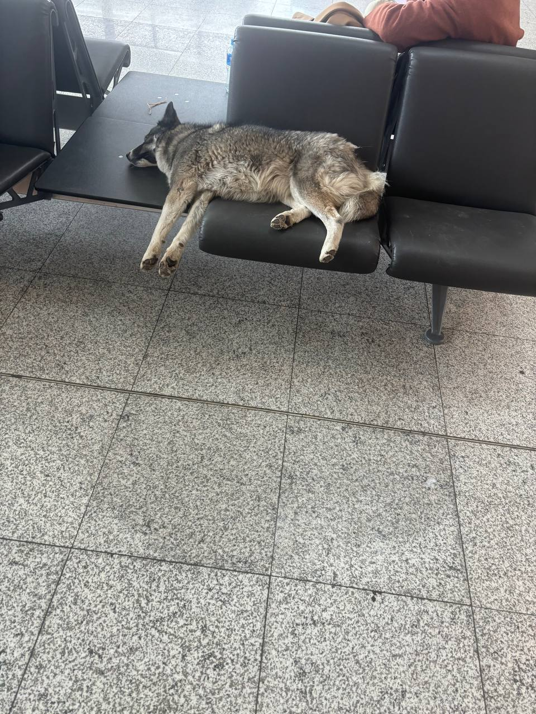
 
 - Метро, оно как американские горки
 
 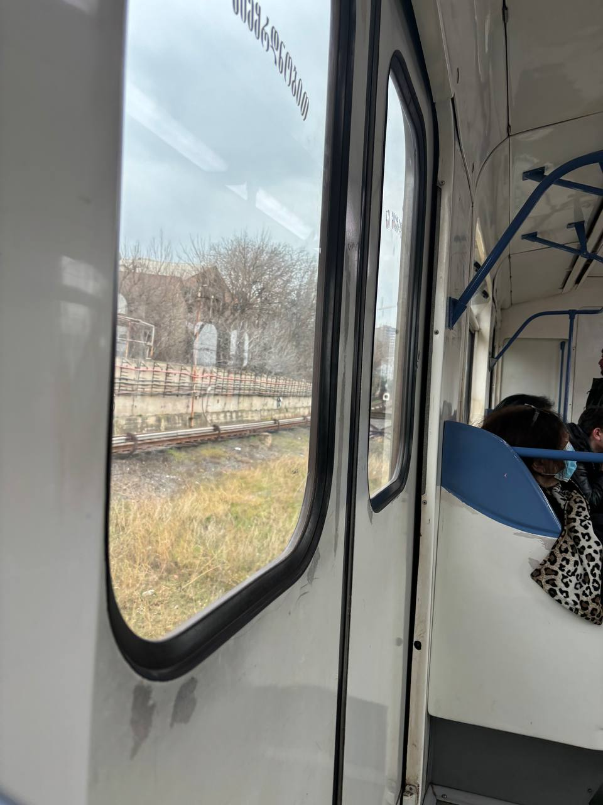
 
 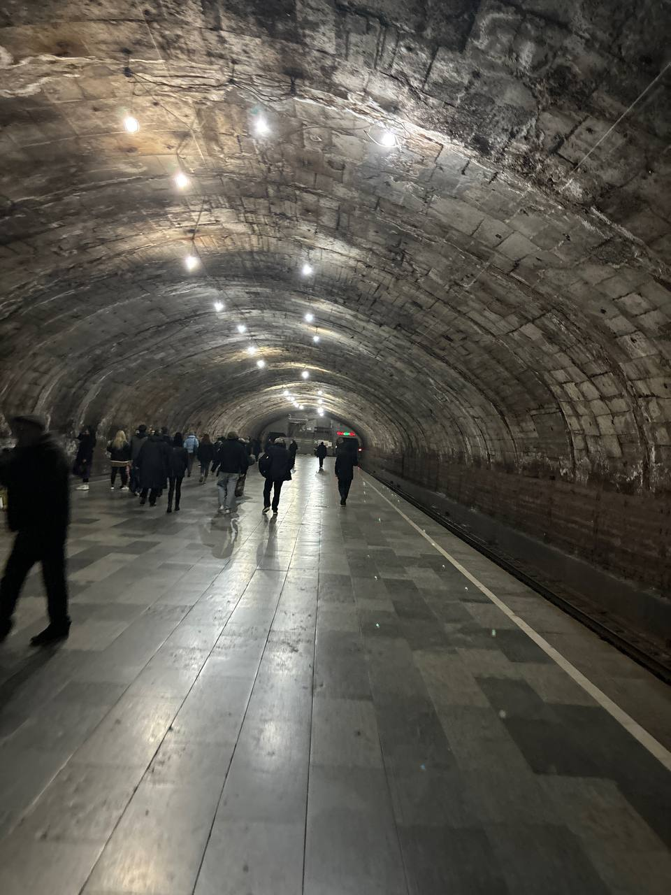
 
 - На табло вместо времени прибытия автобуса, пишется количество остановок, котрорых ему осталочь до твоих
 - Граффити повсюду, не все приличные, но много красивых
 - дранники в макдональдсе, и кола creations по вкусу что-то странное, но того не стоит, чисто на раз
 
 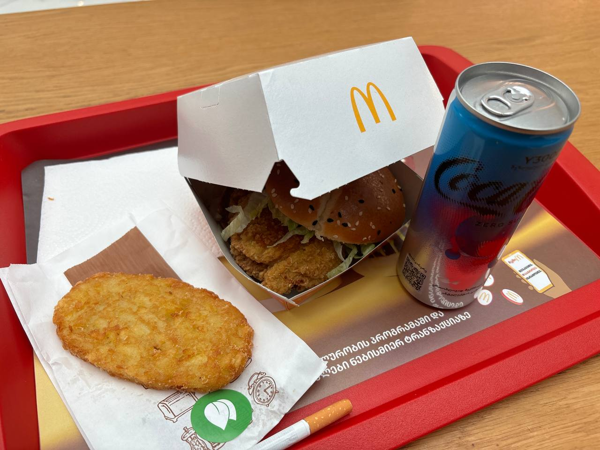
 
 - лимонад Натахтари стоит копейки и уверенно заявляю, это самый вкусный лимонад
 
 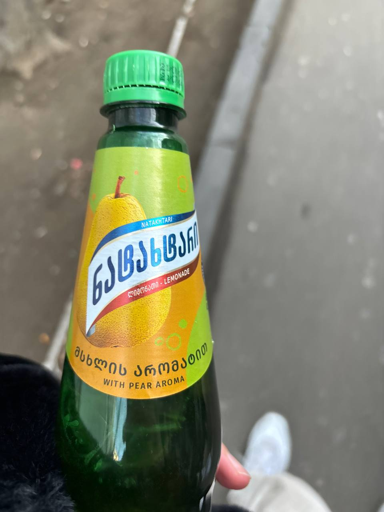
 
 - нет ограничения по времени продажи алкогольной продукции
 - средняя цена хинкалей 60 рублей, в переводе на нашу валюту
